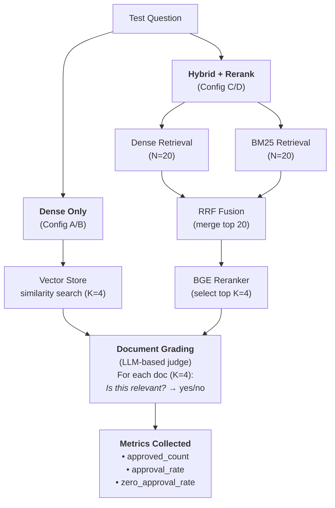

# Retrieval Experiment: Dense vs Hybrid+Rerank

## Overview

This experiment compares dense-only retrieval against a hybrid pipeline (Dense + BM25 + RRF + Rerank) for Case-Based Reasoning on mathematical problem solving. Retrieval quality is evaluated using an LLM-based document grader that judges whether retrieved examples contain transferable problem-solving techniques.

## Experimental Setup

### Configurations

| Config | Dense Embeddings | BM25 | RRF Fusion | Reranker |
|--------|------------------|------|------------|----------|
| A. Dense (Nomic) | Nomic-embed-v1.5 | - | - | - |
| B. Dense (Qwen3) | Qwen3-Embedding-8B | - | - | - |
| C. Hybrid+Rerank (Nomic) | Nomic-embed-v1.5 | Yes | Yes | BGE-reranker-v2-m3 |
| D. Hybrid+Rerank (Qwen3) | Qwen3-Embedding-8B | Yes | Yes | BGE-reranker-v2-m3 |

### Pipeline

The hybrid pipeline performs parallel dense and BM25 retrieval (N=20 each), fuses results via Reciprocal Rank Fusion (RRF, k=60), then reranks with a cross-encoder to select the top K=4 documents.

### Datasets

| Dataset | Test Queries | Retrieval Corpus (Training Set) |
|---------|-------------|--------------------------------|
| GSM8K   | 1,319       | 7,473                          |
| MATH    | 5,000       | 7,500                          |

### Technical Components

| Component | Implementation |
|-----------|----------------|
| Dense Embeddings | Nomic-embed-v1.5 (137M params) or Qwen3-Embedding-8B |
| Vector Store | ChromaDB |
| BM25 | rank_bm25.BM25Okapi |
| Reranker | BAAI/bge-reranker-v2-m3 (CrossEncoder) |
| Grader LLM | Qwen2.5-32B-Instruct via vLLM |

Documents are graded in a single batched vLLM call. The grader outputs a binary "yes"/"no" judgment on whether each document provides adaptable problem-solving techniques for the query.

### Hyperparameters

| Parameter | Value | Description |
|-----------|-------|-------------|
| N_INITIAL | 20 | Documents retrieved per method |
| N_RERANK | 20 | Documents passed to reranker after RRF |
| TOP_K | 4 | Final documents graded |
| RRF_K | 60 | RRF smoothing constant |

---

## Results

### GSM8K (1,319 queries)

| Rank | Config | Avg Approved | Approval Rate | Zero Rate | Coverage |
|------|--------|--------------|---------------|-----------|----------|
| 1 | **B. Dense (Qwen3)** | **3.40** | **85.0%** | **1.4%** | **98.6%** |
| 2 | D. Hybrid+Rerank (Qwen3) | 3.16 | 79.0% | 3.0% | 97.0% |
| 3 | A. Dense (Nomic) | 3.14 | 78.5% | 2.4% | 97.6% |
| 4 | C. Hybrid+Rerank (Nomic) | 3.11 | 77.7% | 3.0% | 97.0% |

#### Approval Distribution (GSM8K)

| Config | 0 docs | 1 doc | 2 docs | 3 docs | 4 docs |
|--------|--------|-------|--------|--------|--------|
| Dense (Qwen3) | 18 | 58 | 120 | 304 | 819 |
| Hybrid+Rerank (Qwen3) | 39 | 92 | 163 | 349 | 676 |
| Dense (Nomic) | 32 | 117 | 152 | 351 | 667 |
| Hybrid+Rerank (Nomic) | 40 | 105 | 173 | 355 | 646 |

### MATH (5,000 queries)

| Rank | Config | Avg Approved | Approval Rate | Zero Rate | Coverage |
|------|--------|--------------|---------------|-----------|----------|
| 1 | **B. Dense (Qwen3)** | **3.48** | **86.9%** | **1.5%** | **98.5%** |
| 2 | A. Dense (Nomic) | 2.86 | 71.4% | 6.1% | 93.9% |
| 3 | D. Hybrid+Rerank (Qwen3) | 2.79 | 69.8% | 5.7% | 94.3% |
| 4 | C. Hybrid+Rerank (Nomic) | 2.63 | 65.8% | 7.7% | 92.3% |

### Coverage (queries with at least 1 relevant example)

| Config | GSM8K | MATH |
|--------|-------|------|
| **Dense (Qwen3)** | **98.6%** (1301/1319) | **98.5%** (4927/5000) |
| Dense (Nomic) | 97.6% (1287/1319) | 93.9% (4697/5000) |
| Hybrid+Rerank (Qwen3) | 97.0% (1280/1319) | 94.3% (4716/5000) |
| Hybrid+Rerank (Nomic) | 97.0% (1279/1319) | 92.3% (4614/5000) |

---

## Analysis

### BM25 Impact

| Dataset | Dense Qwen3 | Hybrid Qwen3 | Penalty |
|---------|-------------|--------------|---------|
| GSM8K | 85.0% | 79.0% | **-6.0pp** |
| MATH | 86.9% | 69.8% | **-17.1pp** |

| Dataset | Dense Nomic | Hybrid Nomic | Penalty |
|---------|-------------|--------------|---------|
| GSM8K | 78.5% | 77.7% | -0.8pp |
| MATH | 71.4% | 65.8% | **-5.6pp** |

The BM25 penalty increases with dataset complexity. On the more diverse MATH dataset, adding BM25 to Dense Qwen3 reduces approval rate by 17.1 percentage points.

### Hyperparameter Sweep (GSM8K, Hybrid Qwen3)

| N_INITIAL | N_RERANK | TOP_K | Approval | Avg Approved | Zero Rate |
|-----------|----------|-------|----------|--------------|-----------|
| **10** | **10** | 4 | **79.9%** | **3.20** | **2.4%** |
| 50 | 20 | 4 | 79.7% | 3.19 | 2.7% |
| 20 (baseline) | 20 | 4 | 79.0% | 3.16 | 3.0% |
| 100 | 50 | 4 | 78.4% | 3.13 | 2.7% |
| 50 | 50 | 4 | 78.2% | 3.13 | 2.5% |

Smaller retrieval pools outperform larger ones. Expanding the candidate pool introduces more noise from BM25 that the reranker fails to filter.

### Zero-Approval Query Analysis (Dense Nomic, GSM8K)

32 queries (2.4%) received zero approved documents. Breakdown by problem type:
- 31% ratio/proportion problems
- 22% rate/time problems
- 22% multi-step problems

Root cause: embeddings match on topic similarity rather than mathematical reasoning structure. A "bakery" problem about unit conversion retrieves other "bakery" problems about quantity counting, not structurally similar unit conversion problems from other domains.

---

## Key Findings

1. **Dense Qwen3 dominates** across both datasets (85-87% approval, 98.5%+ coverage).
2. **Dense outperforms Hybrid** for both embedding models on both datasets.
3. **Embedding model quality is the dominant factor.** Upgrading from Nomic (137M) to Qwen3 (8B) yields +6.5pp on GSM8K and +15.5pp on MATH — far exceeding any pipeline-level improvement.
4. **BM25 degrades retrieval quality for math.** Keyword matching surfaces topically similar but structurally different problems. The penalty grows with dataset complexity (-6pp GSM8K, -17pp MATH).
5. **The BGE reranker cannot compensate** for BM25 noise injection, as it lacks math reasoning awareness.
6. **These results contradict Anthropic's Contextual Retrieval findings** (49-67% failure rate reduction from hybrid retrieval), suggesting that domain-specific retrieval tasks — particularly mathematical reasoning — do not benefit from generic hybrid pipelines.

## Recommendation

Use **Dense Qwen3** for the CBR retrieval pipeline. It is the simplest configuration and outperforms all alternatives. The hybrid approach adds complexity while degrading quality.
