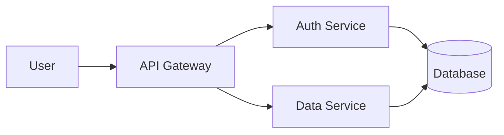

# MarkTeX

A markdown to PDF converter with LaTeX typography and Mermaid diagram support. Designed for GitHub Actions—push markdown, get professionally formatted PDFs.

## Features

- **Markdown to LaTeX/PDF** - Professional typography via LaTeX
- **Mermaid Diagrams** - Flowcharts, sequence diagrams, and more
- **GitHub Actions** - Auto-build PDFs on push
- **Smart Organization** - Mirrored folder structure (PDF/, TEX/, recent/)
- **Multiple Output Modes** - PDF-only, TEX-only, or both

## Use Cases

- Personal notes and documentation
- Academic papers and reports
- Technical documentation with diagrams
- Private markdown sources with shareable PDF outputs

## Workflow

1. Write markdown on GitHub (web, mobile, or local)
2. Push changes
3. GitHub Actions builds PDFs automatically
4. Download or share the generated PDFs

## Installation

### Prerequisites

MarkTeX requires the following external tools:

1. **Pandoc** - Document converter
2. **pandoc-mermaid** - Pandoc filter for Mermaid diagrams
3. **Mermaid CLI** - Diagram renderer
4. **LaTeX toolchain** - PDF generation (texlive)

### Install Prerequisites

```bash
# On Debian/Ubuntu - Install pandoc and LaTeX
sudo apt-get update
sudo apt-get install pandoc texlive-latex-base texlive-latex-extra latexmk

# Install Mermaid CLI via npm
npm install -g @mermaid-js/mermaid-cli

# Install pandoc-mermaid filter via uv
uv tool install --from pandoc-mermaid-filter pandoc-mermaid-filter

# Or via pip
pip install pandoc-mermaid-filter
```

### Install MarkTeX

**Recommended: Install with `uv` as a CLI tool:**

```bash
# From source (recommended for development)
git clone https://github.com/yourusername/marktex.git
cd marktex
uv tool install .

# Once published to PyPI:
uv tool install marktex
```

**Alternative: Install with pip:**

```bash
# From source
git clone https://github.com/yourusername/marktex.git
cd marktex
pip install -e .

# Once published to PyPI:
pip install marktex
```

**Why use `uv tool install`?**
- Installs CLI tools in isolated environments
- Automatically handles PATH for executables
- Cleaner than installing into your global Python environment
- Easy to update: `uv tool upgrade marktex`

## Quick Start

### Basic Usage

```bash
# Generate both .tex and .pdf
marktex my-notes.md

# Generate only PDF (faster, skips .tex)
marktex my-notes.md --pdf-only

# Generate only .tex (for manual editing)
marktex my-notes.md --tex-only

# Check if all dependencies are installed
marktex --check-deps
```

### Organized Folder Structure

When MarkTeX detects (or you specify) a repository root with `PDF/` and `TEX/` folders, it automatically organizes outputs in a mirrored structure:

```
my-docs/                      # Your repository
├── personal/
│   ├── journal.md           # Write here
│   └── ideas.md
├── work/
│   ├── proposals/
│   │   └── project-alpha.md
│   └── notes.md
│
├── PDF/                      # Auto-generated PDFs (mirrored structure)
│   ├── personal/
│   │   ├── journal.pdf
│   │   └── ideas.pdf
│   └── work/
│       ├── proposals/
│       │   └── project-alpha.pdf
│       └── notes.pdf
│
├── TEX/                      # Auto-generated LaTeX (mirrored structure)
│   ├── personal/
│   │   ├── journal.tex
│   │   └── ideas.tex
│   └── work/
│       ├── proposals/
│       │   └── project-alpha.tex
│       └── notes.tex
│
└── recent/                   # Quick access to latest builds
    ├── journal.pdf
    ├── journal.tex
    ├── project-alpha.pdf
    └── project-alpha.tex
```

To use this structure:

```bash
# Create folders at repo root
mkdir PDF TEX recent

# Build with auto-detection
marktex personal/journal.md

# Or explicitly specify repo root
marktex personal/journal.md --repo-root .
```

## GitHub Actions Integration

### Setup Auto-Building

1. **Add the workflow file** (`.github/workflows/build-pdfs.yml`) to your repository (already included if you cloned MarkTeX)

2. **Create folder structure** in your docs repository:
   ```bash
   mkdir PDF TEX recent
   git add PDF TEX recent .github
   git commit -m "Setup MarkTeX auto-building"
   ```

3. **Write markdown and commit:**
   ```bash
   # Edit your markdown files
   git add my-notes.md
   git commit -m "Update notes"
   git push
   ```

4. **GitHub Actions automatically:**
   - Detects changed `.md` files
   - Builds PDFs and TEX files
   - Organizes outputs in mirrored folders
   - Updates `recent/` with latest builds
   - Commits generated files back to your repo

### Workflow Features

- **Only builds changed files** - Fast and efficient
- **Skips documentation** - Won't rebuild README.md, LICENSE.md, etc.
- **Auto-commits outputs** - PDFs and TEX files committed back to repo
- **Prevents loops** - Uses `[skip ci]` to avoid infinite builds
- **Manual trigger** - Can trigger builds manually via GitHub UI

### Sharing PDFs Privately

Since your markdown stays in a **private** repository, you can selectively share PDFs:

**Option 1: GitHub Releases**
```bash
# Create a release with PDF attachments
gh release create v1.0 PDF/work/proposals/project-alpha.pdf
```
Share the release URL - PDF is public, source stays private!

**Option 2: Direct Links**
```bash
# PDFs are committed to your repo
# Share direct GitHub URLs to specific PDFs
# Example: github.com/user/repo/blob/main/PDF/work/report.pdf
```

**Option 3: Download and Share**
```bash
# Download from recent/ or PDF/ folders
# Email or share via any method
```

## Examples

### Example Markdown File

````markdown
# My Technical Report

## Architecture Overview



## Implementation

The system uses a microservices architecture...
````

### Generated Output

Running `marktex report.md` produces:
- **report.pdf** - Beautiful PDF with rendered Mermaid diagram
- **report.tex** - LaTeX source for customization

## Advanced Usage

### Output Modes

```bash
# Default: Both TEX and PDF
marktex document.md

# PDF only (faster, direct conversion)
marktex document.md --pdf-only

# TEX only (for manual LaTeX editing)
marktex document.md --tex-only
```

### Repository Organization

```bash
# Auto-detect repo root (looks for PDF/, TEX/, or .git)
marktex docs/myfile.md

# Explicitly specify repo root
marktex docs/myfile.md --repo-root /path/to/repo

# Simple mode (no folder organization)
# Just outputs alongside source if no repo structure detected
marktex standalone.md
```

## Development

### Project Structure

```
marktex/
├── .github/workflows/
│   └── build-pdfs.yml       # GitHub Actions workflow
├── src/marktex/
│   ├── __init__.py
│   └── cli.py               # Main CLI logic
├── docs/
│   └── example.md           # Example with Mermaid diagrams
├── PDF/                     # Generated PDFs
├── TEX/                     # Generated LaTeX files
├── recent/                  # Latest builds for quick access
├── pyproject.toml           # Package configuration
├── README.md
├── LICENSE
└── .gitignore
```

### Running from Source

```bash
# Install in development mode
pip install -e .

# Run directly
python -m marktex.cli my-notes.md
```

### Testing

```bash
# Check dependencies
marktex --check-deps

# Test with example file
marktex docs/example.md

# Test with folder organization
marktex docs/example.md --repo-root .
```

## Troubleshooting

### Missing Dependencies

If you see errors about missing commands:

```bash
marktex --check-deps
```

This shows which dependencies are missing and how to install them.

### Mermaid Rendering Fails

Ensure `mmdc` is in your PATH:

```bash
which mmdc
mmdc --version
```

If not found:

```bash
npm install -g @mermaid-js/mermaid-cli
```

### LaTeX Compilation Fails

Check that `latexmk` and LaTeX are installed:

```bash
which latexmk
latexmk --version
```

Install if missing:

```bash
sudo apt-get install texlive-latex-base texlive-latex-extra latexmk
```

### GitHub Actions Not Running

1. Check workflow file exists: `.github/workflows/build-pdfs.yml`
2. Ensure you're pushing to `main` or `master` branch
3. Verify markdown files changed (not just PDFs/TEX)
4. Check Actions tab in GitHub for error messages

## Roadmap

### Phase 1 (Current - v0.2.0)
- Multiple output modes (PDF-only, TEX-only, both)
- Mirrored folder organization (PDF/, TEX/, recent/)
- GitHub Actions workflow
- Auto-detection of repository structure

### Phase 2 (Planned)
- Direct `.tex` editing support (TEX → PDF rebuilds)
- Configuration file (`.marktex.yaml`)
- Watch mode for local development (`--watch`)
- Cleanup auxiliary files (`--clean`)
- Custom LaTeX templates
- Batch processing with glob patterns

## Why MarkTeX?

**The Problem:**
- Markdown is great for writing, but GitHub rendering doesn't look as good as LaTeX
- PDF exports from other tools don't have professional typography
- Managing multiple documents across different tools is messy
- Sharing requires either exposing source or manual export workflows

**The Solution:**
- **Write:** GitHub's editor (anywhere, any device)
- **Read:** LaTeX PDFs with professional typography
- **Organize:** GitHub's free storage and file system
- **Share:** Selective PDF sharing, keep sources private
- **Automate:** GitHub Actions builds everything

## License

MIT License - See [LICENSE](LICENSE) file for details

## Contributing

Contributions welcome! Please:

1. Fork the repository
2. Create a feature branch
3. Make your changes
4. Submit a pull request

## Acknowledgments

- [Pandoc](https://pandoc.org/) - Universal document converter
- [Mermaid](https://mermaid.js.org/) - Diagram and flowchart tool
- [pandoc-mermaid-filter](https://github.com/raghur/mermaid-filter) - Pandoc filter for Mermaid
- [LaTeX](https://www.latex-project.org/) - Document preparation system

