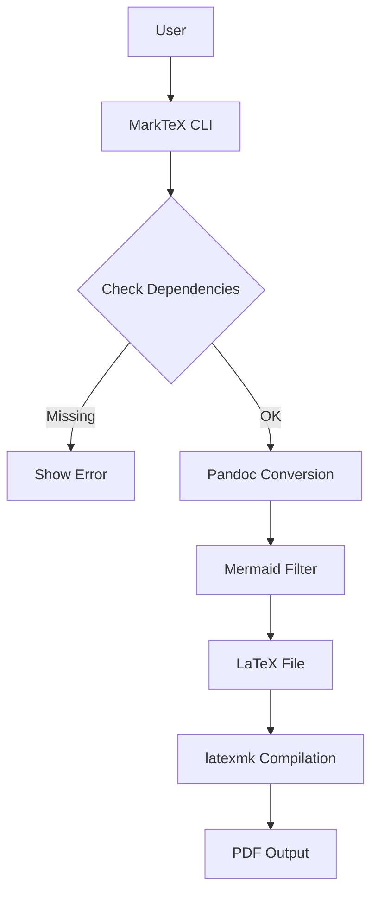
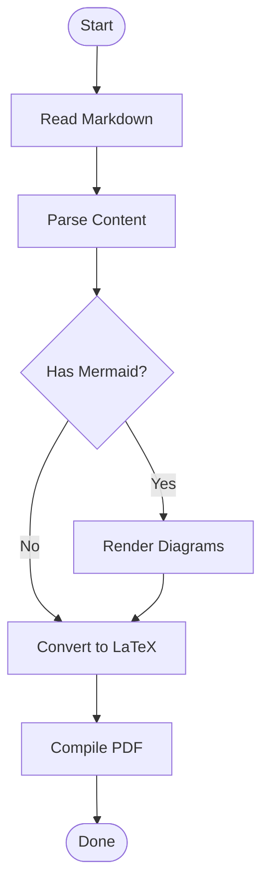
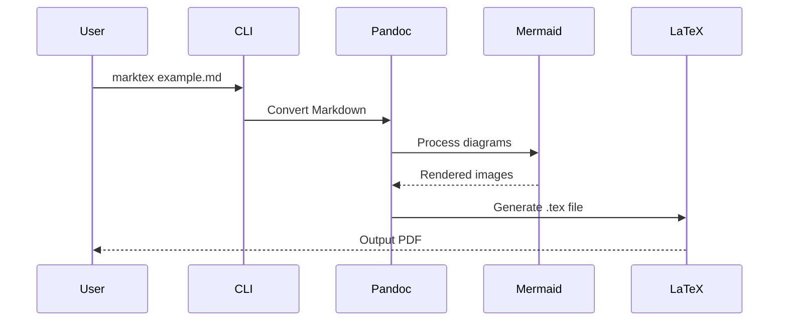
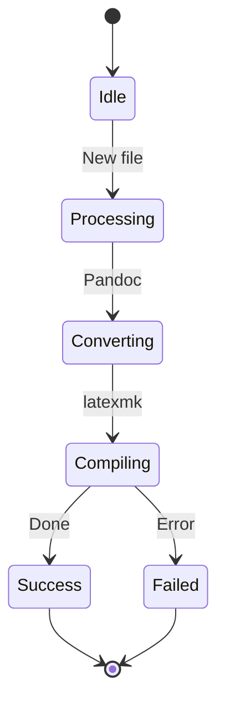

# Initial Workflow Test Commit
# MarkTeX Example Document

This is a sample document demonstrating MarkTeX's ability to convert Markdown with Mermaid diagrams to beautiful PDFs.

## Introduction

MarkTeX combines the simplicity of Markdown with the power of LaTeX and the clarity of Mermaid diagrams. This makes it perfect for:

- Technical documentation
- Research reports
- Project proposals
- Academic papers
- System design documents

## Workflow Diagram

Here's a simple workflow showing how MarkTeX processes your documents:


## System Architecture

Complex systems are easier to understand with diagrams:



## Process Flow



## Code Example

MarkTeX also handles code blocks beautifully:

```python
def convert_markdown_to_pdf(input_file):
    """Convert a Markdown file to PDF using MarkTeX."""
    subprocess.run([
        "marktex",
        input_file
    ])
    print(f"✓ Converted {input_file} to PDF!")
```

## Features

### Text Formatting

You can use **bold**, *italic*, `inline code`, and even ~~strikethrough~~ text.

### Lists

Ordered lists:

1. First item
2. Second item
3. Third item

Unordered lists:

- Feature A
- Feature B
  - Sub-feature B.1
  - Sub-feature B.2
- Feature C

### Tables

| Feature | Markdown | LaTeX | PDF |
|---------|----------|-------|-----|
| Text    | ✓        | ✓     | ✓   |
| Images  | ✓        | ✓     | ✓   |
| Diagrams| ✓        | ✓     | ✓   |
| Math    | ✓        | ✓     | ✓   |

### Mathematics

Inline math: $E = mc^2$

Block math:

$$
\int_{-\infty}^{\infty} e^{-x^2} dx = \sqrt{\pi}
$$

## Sequence Diagram



## State Diagram



## Conclusion

MarkTeX makes it easy to create professional documents with diagrams. Simply write your content in Markdown, add Mermaid diagrams where needed, and run:

```bash
marktex example.md
```

That's it! You'll get a beautiful PDF with all your diagrams rendered perfectly.

## Learn More

- GitHub: https://github.com/yourusername/marktex
- Documentation: See README.md
- License: MIT

---

*Generated with MarkTeX - Markdown to PDF made simple.*
